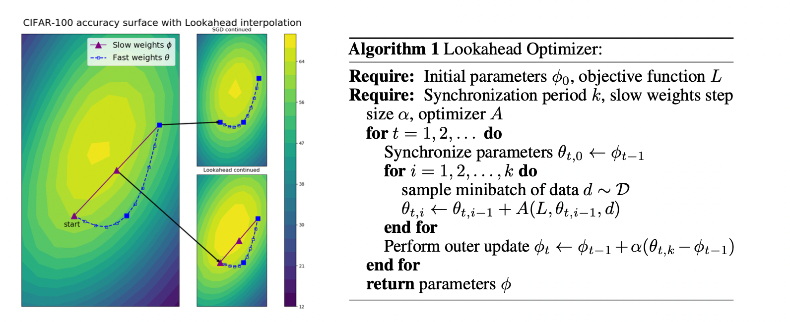

# oppo query pair match

### lookahead

https://arxiv.org/pdf/1907.08610.pdf

简述：向前走k步，更新一步

有点类似 Nesterov Momentum 的思想，只是把k步变成了1步

### RoBERTa

1. 静态mask -> 动态mask

   针对N个epoch划分10 份，对每一份分别做mask，这样导致对每个句子有机会mask不同的token，使mask更加丰富。 maksfor whole word mask是对每一此迭代的样本进行随机的mask

2. with NSP -> without NSP

   使用full-sentence替代，full-sentence比 segment-pair, sentence-pair, doc-sentence效果都更好，因为其可以捕捉到长文本之间的依赖关系

3. 更大的mini-batch

   原BERT batch_size = 256，1M个step，修改为batch_size=8k，31k个step，batch_size提升40倍。更大的batch_size，更小的lr

4. 更多的数据，更长的训练时间

优秀博客

https://www.cnblogs.com/tfknight/p/13353642.html

### ELECTRA

### albert

三个大点+1个小点

1. Embeding参数因式分解，emb_size: 768 - > 128

2. 参数共享，各个encoder的attention参数共享

3. NSP -> SOP

   Next sentence predict -> sentence order predict

4. n-grams masking

### 预训练优化器使用lookahead：会导致学习率特别低，还没找到原因

